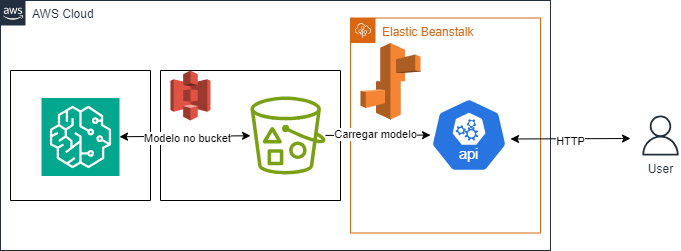

# 🚀 Classificação de Reservas por Faixa de Preço

Trata-se de uma solução para prever faixas de preço de quartos de hotéis utilizando técnicas de Machine Learning em conjunto com serviços da AWS. Através do treinamento do modelo especializado, capaz de classificar reservas em diferentes faixas de preço, é oferecida uma abordagem precisa e eficiente para a análise de dados hoteleiros.

A solução é entregue por meio de uma API Python, hospedada em um ambiente Docker no AWS Elastic Beanstalk. Essa API disponibiliza um endpoint acessível para realizar inferências sobre os preços das reservas de hotéis. Os dados necessários para realizar a inferência devem ser fornecidos em formato JSON no corpo das requisições, contendo as informações relevantes para a previsão das faixas de preços dos quartos de hotéis.

***

## 🖳 Desenvolvimento

Para o desenvolvimento do projeto, a linguagem Python desempenhou um papel fundamental no tratamento meticuloso da base de dados e na construção do modelo de Machine Learning. Além disso, Buckets S3 foram essenciais para armazenar tanto os dados originais dividos para treinamento e teste quanto os modelos gerados durante o processo. O serviço SageMaker foi empregado para o treinamento e ajuste fino (tuning) do modelo de Machine Learning, aproveitando as capacidades de escala e automação oferecidos pelo serviço.

A coleta dos dados foi realizada a partir da base de dados Hotel Reservations, fornecendo as informações essenciais para o treinamento do modelo. Após o treinamento, que visava prever as faixas de preço dos quartos de hotéis, utilizou-se o framework Flask e a plataforma Docker para criar e disponibilizar uma API conteinerizada. Essa API, com endpoints configurados, foi então implantada no serviço Amazon Elastic Beanstalk da AWS, garantindo uma infraestrutura escalável e confiável para o serviço. 


***

## ✨ Base de Dados Utilizada


A base de dados utilizada, denominada [`Hotel Reservations Dataset`](https://www.kaggle.com/datasets/ahsan81/hotel-reservations-classification-dataset), concentra-se em informações de várias reservas de hotéis. O objetivo da previsão foi baseado na coluna `avg_price_per_room`, a qual foi substituída pela coluna `label_avg_price_per_room`. Esta última atribui valores numéricos de 1 a 3, dependendo do preço do quarto. Essa transformação permitiu a criação de faixas de preço para facilitar o treinamento do modelo de Machine Learning.

***

##  🛠️ Como Utilizar

### Em caso do serviço estar ativo:

Acesse: 
```
http://sprint5hotelprice.us-east-1.elasticbeanstalk.com/
```
#### Acesso da rota

Para rota do modelo:
```
http://sprint5hotelprice.us-east-1.elasticbeanstalk.com/api/v1/predict
```

### Em caso de rodar localmente:
1. Clone esse repositório em sua máquina local
2. Copie o conteúdo de `.env.example` para um arquivo `.env`
3. Rode o comando `docker build -t flask-api-image . `
4. Em seguida, rode o comando `docker run -p 8080:8080 --name flask-api-container --rm flask-api-image`
5. A api estará rodando em `localhost:8080/api/v1/predict`
6. Através do `POSTMAN`, utilizando metódo `POST` é necessário enviar um `JSON` no corpo da requisição.
7. Exemplo de `JSON` a ser utilizado:

```json
{"no_of_adults":2,"no_of_children":0,"no_of_weekend_nights":1,"no_of_week_nights":2,"type_of_meal_plan":"Meal Plan 1","required_car_parking_space":0,"room_type_reserved":"Room_Type 1","lead_time":224,"arrival_year":2017,"arrival_month":10,"arrival_date":2,"market_segment_type":"Offline","repeated_guest":0,"no_of_previous_cancellations":0,"no_of_previous_bookings_not_canceled":0,"avg_price_per_room":65.0,"no_of_special_requests":0,"booking_status":"Not_Canceled"}
```

***

## 🔧 Tecnologias Utilizadas

<div style="display: inline_block">

  <table border="1">
    <tr>
        <th>Tecnologia</th>
        <th>Versão</th>
    </tr>
    <tr>
        <td> <a href="https://www.python.org/"></a> Python</td>
        <td>3.11.8</td>
    </tr>
    <tr>
        <td> <a href="https://flask.palletsprojects.com/en/3.0.x/"></a> Flask</td>
        <td>3.0.2</td>
    </tr>
    <tr>
        <td> <a href="https://numpy.org/"></a> NumPy</td>
        <td>1.26.4</td>
    </tr>
    <tr>
        <td> <a href="https://scipy.org/"></a> SciPy</td>
        <td>1.12.0</td>
    </tr>
    <tr>
        <td> <a href="https://scikit-learn.org/stable/"></a> scikit-learn</td>
        <td>1.4.1.post1</td>
    </tr>
    <tr>
        <td> <a href="https://aws.amazon.com/pt/sdk-for-python/"></a> boto3</td>
        <td>1.34.69</td>
    </tr>
    <tr>
        <td> <a href="https://xgboost.ai/"></a></td>
        <td>2.0.3</td>
    </tr>
    <tr>
        <td> <a href="https://www.docker.com/"></a> Docker</td>
        <td>3.0.2</td>
    </tr>
    <tr>
        <td> <a href="https://aws.amazon.com/pt/s3/"></a> AWS S3</td>
        <td>-</td>
    </tr>
    <tr>
        <td> <a href="https://aws.amazon.com/sagemaker/"></a> AWS SageMaker</td>
        <td>-</td>
    </tr>
    <tr>
        <td> <a href="https://docs.aws.amazon.com/elastic-beanstalk/"></a> AWS Elastic Beanstalk</td>
        <td> - </td>
    </tr>
  </table>
</div>

***

## 🧱 Estrutura de Diretórios e Arquivos
```
/sprint5/sprint-5-pb-aws-ifsul-ufersa
├── Dockerfile
├── README.md
├── images
|  └── cloud-architecture.png
├── requirements.txt
└── src
   ├── ML
   |  ├── data
   |  |  ├── Hotel Reservations.csv
   |  |  ├── hotel_room_prices_test.csv
   |  |  └── hotel_room_prices_train.csv
   |  └── notebook
   |     ├── hotel-room-price-classifier.ipynb
   |     └── hotel-room-price-xgboost.ipynb
   └── api
      ├── app.py
      └── predict
         ├── controllers
         |  └── prediction_controller.py
         ├── models
         |  └── reservation.py
         ├── predict.py
         └── utils
            └── load_model.py
```

- [`src/api/app.py`](./src/api/app.py): Ponto de entrada da aplicação
- [`src/api/predict/predict.py`](./src/api/predict/predict.py): Define o Blueprint do Flask para a rota de previsões
- [`src/api/predict/controllers/prediction_controller.py`](./src/api/predict/controllers/prediction_controller.py): Responsável pela Lógica da Rota
- [`src/api/predict/models/reservation.py`](./src/api/predict/models/reservation.py) : Responsável por converter e armazenar os dados recebidos
- [`src/api/predict/utils/load_model.py`](./src/api/predict/utils/load_model.py) : Responsável por carregar o modelo
- [`src/ML`](./src/ML/): Diretório onde é feito o Machine Learning.
- [`src/ML/notebook`](./src/ML/notebook/): Diretório que se localiza os notebooks para treinamento da máquina.
- [`src/ML/data`](./src/ML/data/): Diretório que contem as bases de dados utilizadas.
- [`images/`](/images/): Diretório que contem as imagens utilizadas nesse readme.

***

## ☁️ Arquitetura Cloud

<div align= "center">
  
</div>

***

## 🛑 Dificuldades Conhecidas

- `Acessar bucket s3`: inicialmente estávamos com dificuldade de acessar o bucket S3 de forma local, porém após ser feito correção nas roles IAM e no perfil do sagemaker, foi possível acessar normalmente a bucket s3;
- `Importar o modelo`: devido necessidade de efetuar o deploy do endpoint fora da AWS SageMaker, foi necessário buscar meios de rodar o modelo localmente para fazer as previsões, a partir disso enfrentamos dificuldades no momento da importação do modelo com os dados formatados corretamente;
- `Implantação da aplicação no Elastic Beanstalk`: para obter sucesso nessa tarefa, alterações no Dockerfile tiveram de ser feitas, uma nova VPC e um novo Security Group tiveram de ser criados.

***

## 👨‍💻 Desenvolvedores

- <a href="https://github.com/gmpandolfo">Gabriel Pandolfo</a>
- <a href="https://github.com/0renz">Lorenzo Schauenberg</a>
- <a href="https://github.com/araujorafael9201">Rafael Araujo</a>
- <a href="https://github.com/ratelp">Rafael Martinho</a>
